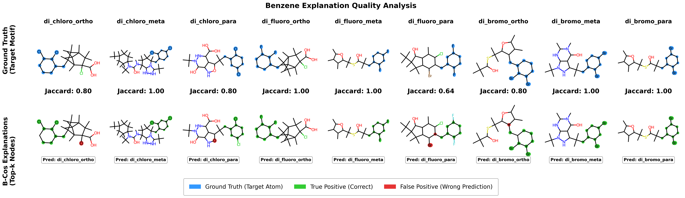

# Di-Halo-Benzene-Isomer Dataset Documentation

## Data Splits
We provide a single, standard stratified train, validation, and test split to ensure reproducible evaluation and preserve class distributions across all sets. 
* **Train:** `train.pt` / `train_ids.txt` (80%)
* **Validation:** `val.pt` / `val_ids.txt` (10%)
* **Test:** `test.pt` / `test_ids.txt` (10%)

---

## DATASET STATISTICS REPORT              
Total Graphs: 9000

### Dimensions
Node Feature Dim (x):        10
Edge Feature Dim (edge_attr): 4

### Encoding Check
Are Nodes One-Hot?           True
Are Edges One-Hot?           True

### Class Distribution

| Class ID | Name | Count |
| :--- | :--- | :--- |
| 0 | Cl_Ortho_Me | 1000 |
| 1 | Cl_Meta_Me | 1000 |
| 2 | Cl_Para_Me | 1000 |
| 3 | F_Ortho_Me | 1000 |
| 4 | F_Meta_Me | 1000 |
| 5 | F_Para_Me | 1000 |
| 6 | Br_Ortho_Me | 1000 |
| 7 | Br_Meta_Me | 1000 |
| 8 | Br_Para_Me | 1000 |

## Dataset Construction & Grafting Protocol

The dataset is constructed by systematically modifying drug-like molecular scaffolds to create a multi-class graph classification task.

Base Scaffolds: Randomly sampled SMILES strings from a clean, drug-like subset of the ZINC database.

Di-Halo Benzene Motifs: The dataset defines 9 specific structural motifs (classes) containing a methyl linker attached to a di-halo benzene ring. These cover combinations of 3 halogens (Chlorine, Fluorine, Bromine) across 3 structural positions (Ortho, Meta, Para).

### Grafting Mechanism: 
1. A valid Carbon-Hydrogen (C-H) pair is located on the ZINC scaffold.
2. The Hydrogen atom is removed.
3. The motif is spliced onto the scaffold by forming a single bond between the targeted Carbon and the motif's methyl linker.

Balancing: All 9 motif variations are generated for each successfully processed base scaffold to ensure a perfectly balanced multi-class dataset.

### Graph Feature Encodings

Molecules are converted into PyTorch Geometric (PyG) graph structures where nodes are atoms and edges are bonds.

**Node Features (Atom Encoding):**

- Nodes are represented by a 10-dimensional one-hot encoded vector.

- The encoding checks against a permitted list of 10 atoms: C, N, O, S, F, Cl, Br, I, P, H.

- Any atom symbol not found in this list is mapped to Carbon (C) by default.

**Edge Features (Bond Encoding):**

- Edges are represented by a 4-dimensional one-hot encoded vector.

- The encoding checks against 4 standard RDKit bond types: SINGLE, DOUBLE, TRIPLE, and AROMATIC.

- Any unrecognized bond type defaults to a SINGLE bond.

## Dataset sample for each class

